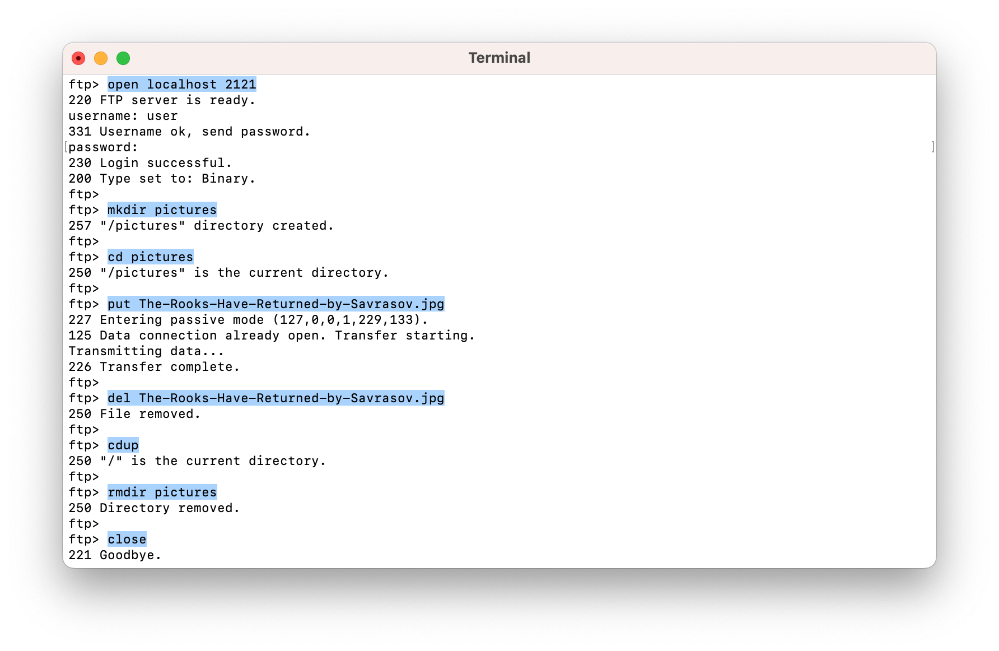

# Command-Line FTP Client

The command-line FTP client is a standalone application based on `libftp`.

## Commands

1. open hostname [ port ] - connect to ftp server
1. user username - send new user information
1. cd remote-directory - change working directory on the server
1. cdup - change working directory on the server to parent directory
1. ls [ remote-directory ] - list contents of remote directory
1. pwd - print working directory on the server
1. mkdir directory-name - make directory on the server
1. rmdir directory-name - remove directory on the server
1. put local-file [ remote-file ] - upload file to the server
1. get remote-file [ local-file ] - download file from the server
1. rename from-remote-path to-remote-path - rename file/directory on the server
1. size remote-file - show size of remote file
1. del remote-file - delete file on the server
1. stat [ remote-file ] - show current status
1. syst - show remote system type
1. type - show current transfer type
1. binary - set binary transfer type
1. ascii - set ascii transfer type
1. mode - show current mode for data connection
1. active - set active mode for data connection
1. passive - set passive mode for data connection
1. noop - no operation
1. rhelp [ remote-command ] - get help from the server
1. logout - log out current user
1. close - close ftp connection
1. help - print local help information
1. exit - close ftp connection and exit